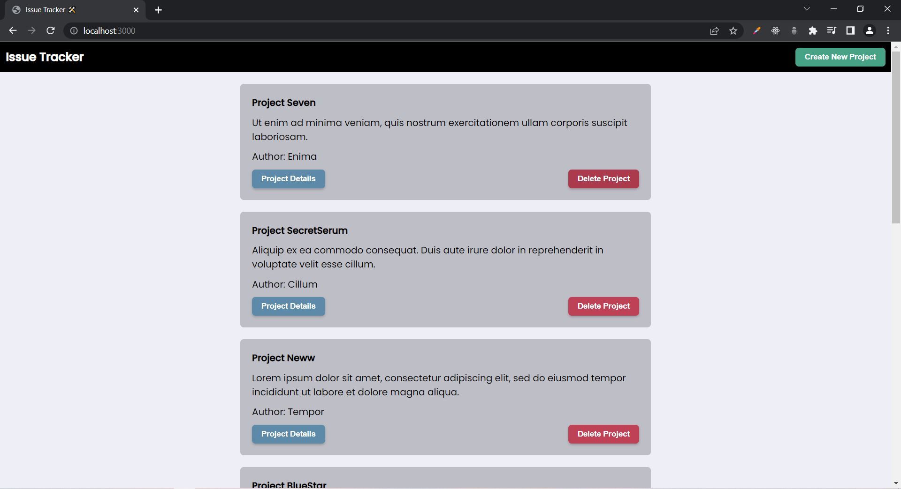
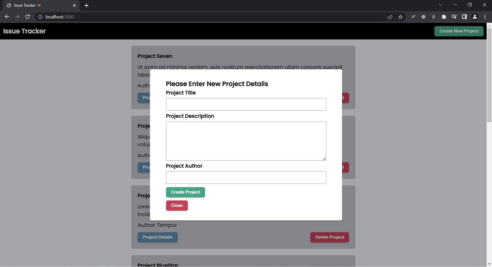
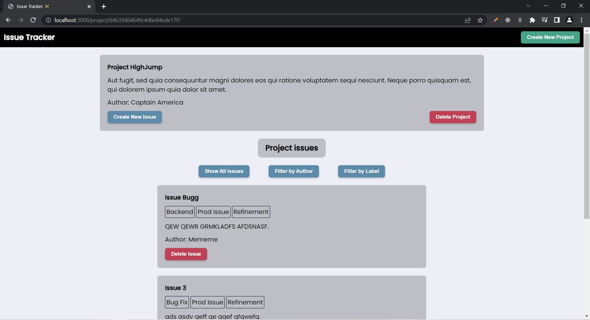
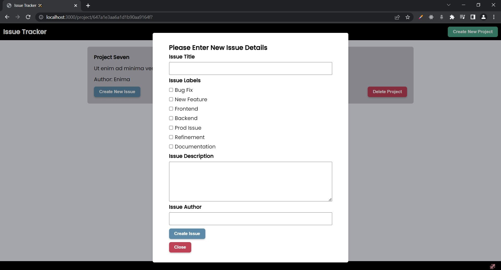

# Issue Tracker Project

Access this project live here -->

This is a issue tracker portal where you can create and delete multiple projects.
For each of the projects you can create ad delete issues.
You can filter these issues based on labels or authors.

## Tech Stack

This project uses NodeJs for backend routing with EJS templating engine for frontend.
It is styled using vanilla CSS.
